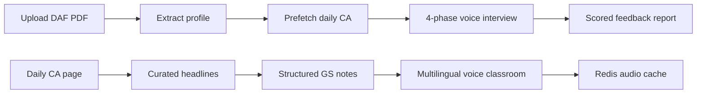
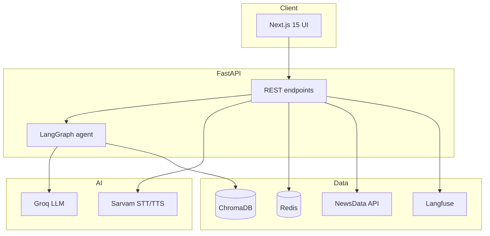

# BoardPrep AI — UPSC Mock Interview & Daily CA Voice

Voice-first **UPSC Personality Test** prototype inspired by SuperKalam-style workflows: DAF-aware mock interview, daily current affairs with structured notes, and **multilingual teacher voice briefings** (11 Indian languages via Sarvam).

> Portfolio / internship project — demonstrates agentic AI pipelines, conversational voice agents (STT/TTS), hybrid RAG, and fullstack ed-tech delivery.

---

## Demo

| Step | Action |
|------|--------|
| 1 | Start backend + frontend (see below) |
| 2 | Open [http://localhost:3000](http://localhost:3000) |
| 3 | Upload demo DAF: `data/sample_daf_upsc_format_1.pdf` |
| 4 | Complete voice interview (or use `?dev=1` for text answers) |
| 5 | [Daily Current Affairs](http://localhost:3000/current-affairs) — pick class language, Listen or Play full edition |

---

## Quick start

```bash
# Backend (from project root)
source venv/bin/activate
uvicorn app.api.main:app --host 127.0.0.1 --port 8000 --reload

# Frontend
cd web && npm install && npm run dev -- -H 127.0.0.1 -p 3000
```

Always use the project **venv** — system `python3` has a different ChromaDB version and can corrupt `data/chroma`.

**One `.env` at project root** — backend and frontend both read it (`web/next.config.ts` loads parent `.env`). Do not create `web/.env.local`.

```bash
cp .env.example .env   # add API keys once
```

| Key | Purpose |
|-----|---------|
| `NEXT_PUBLIC_API_URL` | Frontend → backend URL (default `http://127.0.0.1:8000`) |
| `GROQ_API_KEY` | LLM — questions, DAF extract, enrichment, briefing, feedback |
| `GROQ_MODEL` | Default: `qwen/qwen3.8-27b` |
| `SARVAM_API_KEY` | STT (`saaras:v3`) + TTS (`bulbul:v3`, speaker `aayan`) |
| `NEWSDATA_API_KEY` | Daily newspaper headlines |
| `REDIS_URL` | Session state + daily CA bundle + prewarmed voice cache |
| `LANGFUSE_*` | Optional — LLM/voice pipeline tracing |

Redis should be running locally (`redis://localhost:6379`).

---

## What it does



### 1. Voice mock interview

| Phase | Focus |
|-------|--------|
| DAF opening | Hobbies, education, background from your form |
| Subject probe | Optional subject + syllabus hybrid RAG |
| Current affairs | Daily news linked to DAF + grounding check |
| Closing | Motivation, ethics, service preference |

- **LangGraph** state machine: evaluate → route (probe / pivot / advance) → generate question
- **STT:** Sarvam `saaras:v3` codemix (Hindi/English/Hinglish)
- **TTS:** Sarvam `bulbul:v3` — screen English, spoken Hindi/Hinglish for questions
- **Modes:** `quick` (4 Q) or `full` (12 Q) via upload form

### 2. Daily current affairs voice classroom

- **10 headlines/day** across GS pillars (polity, economy, IR, environment, etc.)
- Sources: **The Hindu** and **Indian Express** only (today's headlines via NewsData.io)
- **Read** structured notes (highlights, GS tags, prelims/mains pointers)
- **Listen** → Aayan teaches the story (~1 min) in your chosen language
- **Play full edition** — sequential playlist with study progress + streak
- **11 languages:** Hindi, English, Bengali, Tamil, Telugu, Marathi, Kannada, Gujarati, Malayalam, Punjabi, Odia

**Voice quality rules (prompt-enforced):**
- Never read the English headline aloud — open with a hook question
- Native script only (no Roman letters in Indic languages)
- Meaning in local language, not English phonetics in Devanagari/Tamil/etc.
- Screen fields stay English; `briefing_voice` is fully localized

---

## Architecture

High-level design lives in **[SYSTEMARCHITECTURE.md](./SYSTEMARCHITECTURE.md)** with full Mermaid diagrams.



---

## API endpoints

| Method | Path | Description |
|--------|------|-------------|
| `GET` | `/health` | Health check + `ca_preparing` flag |
| `POST` | `/upload-daf` | Upload PDF, extract profile, start CA prefetch |
| `POST` | `/start-interview` | First question + TTS audio |
| `POST` | `/respond` | Audio/text answer → next turn |
| `GET` | `/feedback-report/{id}` | Rubric scores + DAF flags |
| `GET` | `/metrics/{id}` | Per-session latency breakdown |
| `GET` | `/current-affairs/daily` | Today's curated CA list |
| `GET` | `/current-affairs/languages` | Supported voice languages |
| `POST` | `/current-affairs/explain` | Voice briefing for one article (`language` param) |
| `GET` | `/current-affairs/prewarm-status` | Audio cache readiness |
| `POST` | `/current-affairs/prewarm` | Trigger voice prewarm for a language |

---

## Tech stack

| Layer | Tools |
|-------|--------|
| Backend | Python, FastAPI, LangGraph, LangChain-Groq |
| LLM | Groq (`qwen/qwen3.8-27b`) |
| Voice | Sarvam — `saaras:v3` STT, `bulbul:v3` TTS (speaker `aayan`) |
| RAG | ChromaDB + hybrid BM25/vector (`intfloat/multilingual-e5-small`) |
| Cache | Redis — sessions (1h), daily CA bundle (24h), per-language voice audio |
| Observability | Langfuse traces + in-app step timing |
| Frontend | Next.js 15, React 19, Tailwind CSS, Recharts |

---

## Project structure

```
superkalam/
├── app/
│   ├── api/main.py              # FastAPI routes, CA orchestration, prewarm
│   ├── agents/                  # LangGraph interview flow + nodes
│   ├── tools/                   # DAF, news fetch/enrich, briefing, voice, cache
│   ├── rag/                     # Chroma ingest + hybrid retrieval
│   ├── prompts/                 # LLM prompt templates (DAF, Q&A, CA, eval)
│   ├── config/
│   │   ├── config.py            # Env + interview modes
│   │   └── ca_languages.py      # 11-language TTS registry
│   ├── observability/           # Langfuse client
│   └── schema/                  # Pydantic domain models
├── web/
│   ├── app/                     # Pages: home, interview, CA, feedback
│   ├── components/              # Voice UI, briefing cards, study progress
│   └── lib/                     # API client, audio, voice-language prefs
├── data/
│   └── sample_daf_upsc_format_1.pdf
├── SYSTEMARCHITECTURE.md
└── README.md
```

---

## Key engineering patterns

| Pattern | Where |
|---------|--------|
| Agentic workflow | LangGraph phases + conditional router |
| Async Parallel Hybrid RAG | Concurrent Vector search + cached LangChain `BM25Retriever` index |
| Real-Time Streaming TTS | SSE sentence chunking (`/respond-stream`) for <800ms Time-to-First-Audio |
| Multilingual Voice Engine | Per-language prompts, script checks, Sarvam `*-IN` codes (11 Indian languages) |
| Graceful fallback | Groq cooldown, static CA JSON, browser TTS, short voice scripts |
| Production-minded | Single-flight locks, rate-limit guards, no cache on TTS failure |
| Observability | Langfuse spans on STT/TTS/LLM/RAG (`rag_hybrid_retrieve`); `/metrics` per session |

---

## Limitations (honest scope)

- Prototype — no auth, no user history DB, no horizontal scale
- Daily CA depends on NewsData availability and Groq/Sarvam API quotas
- First daily CA enrich may take 30–60s; Hindi voice prewarm runs in background (~1–2 min for 10 stories)
- Other languages generate on first Listen (then cached in Redis)
- Voice quality depends on Sarvam credits and prompt adherence

---

## License & ethics

- News from **NewsData.io** and local fallback JSON only
- No scraping of commercial prep platforms
- Built as an engineering demo inspired by structured CA + mock interview workflows

---

## Push to GitHub

`.gitignore` excludes secrets, `venv/`, `node_modules/`, `.next/`, Redis dumps, and local Chroma/upload data.

```bash
cd superkalam
cp .env.example .env          # add keys locally — never commit .env
git init -b main
git add .
git status                    # verify .env and dump.rdb are NOT listed
git commit -m "Initial commit: UPSC mock interview + daily CA voice"
git remote add origin https://github.com/YOUR_USERNAME/YOUR_REPO.git
git push -u origin main
```

---

*Last updated: September 2026*
