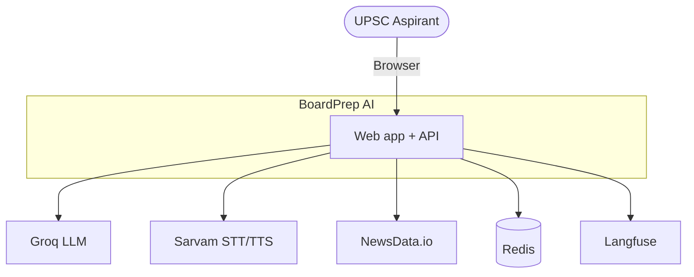
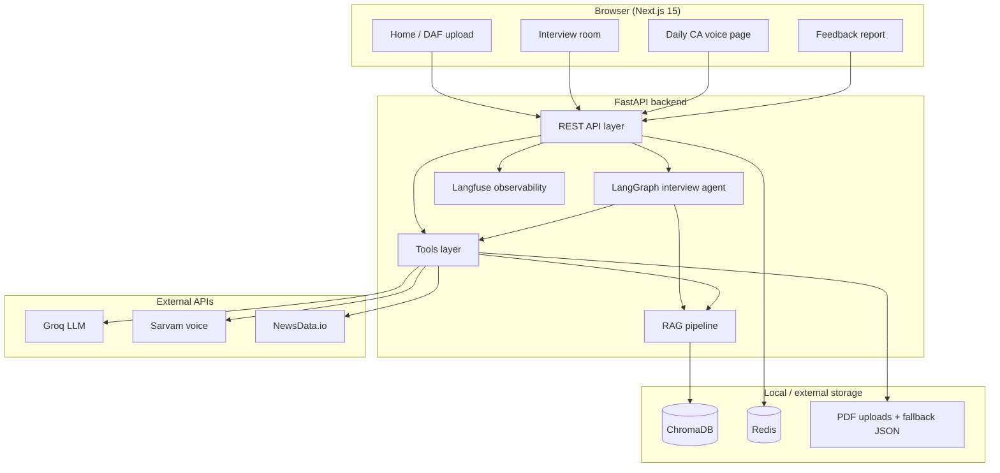
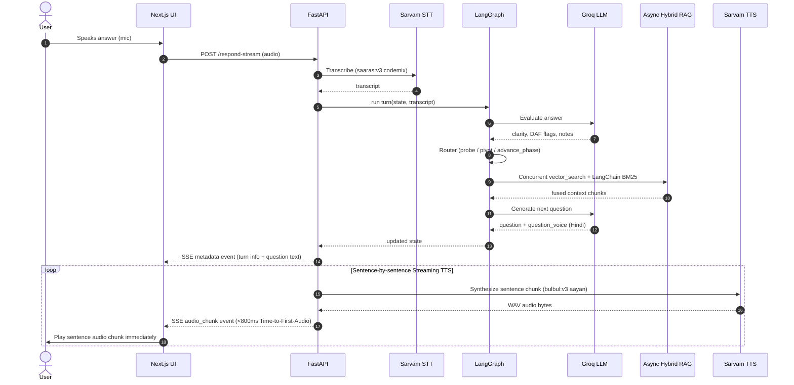
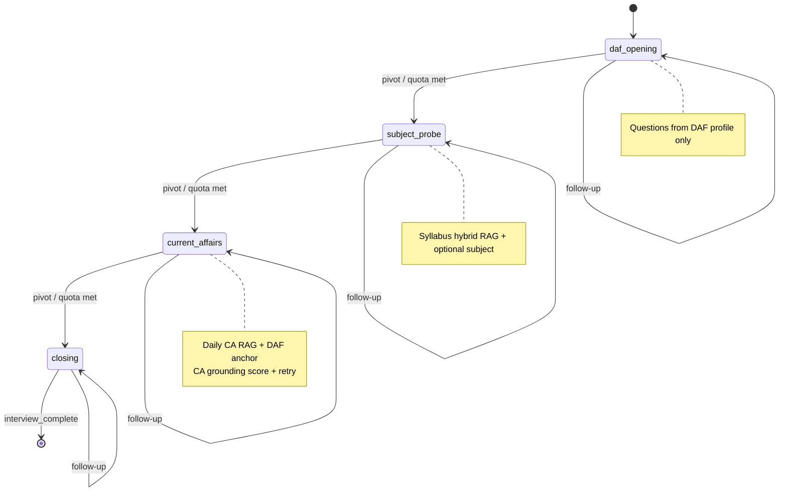
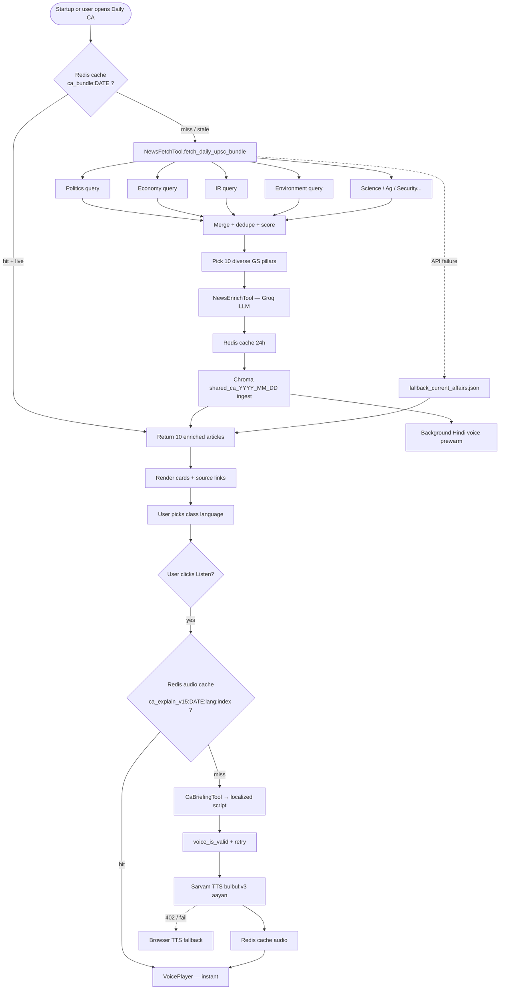
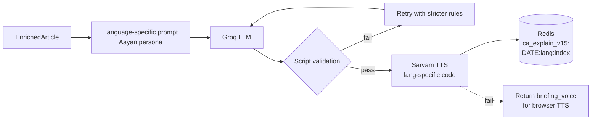
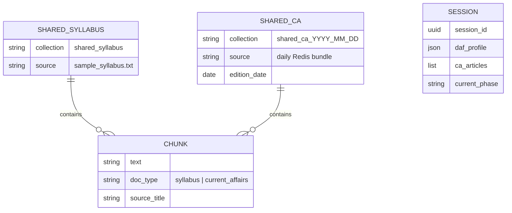
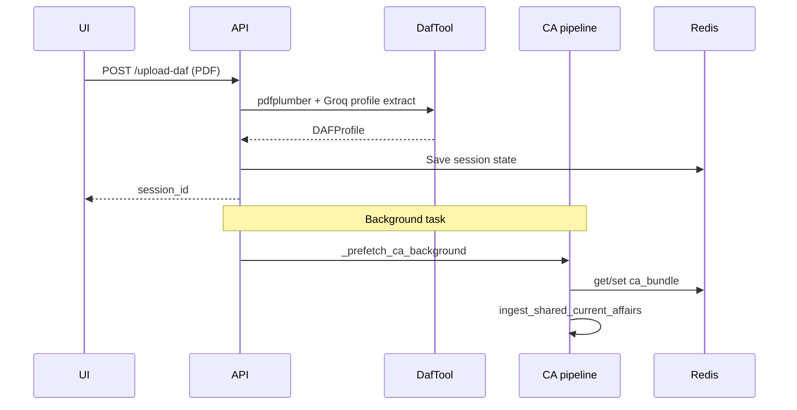
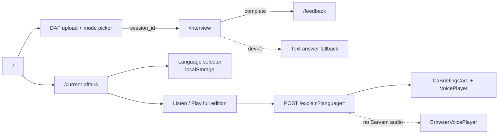

# System Architecture — BoardPrep AI

This document describes how the UPSC mock interview + daily CA voice prototype is structured. All diagrams use [Mermaid](https://mermaid.js.org/) and render on GitHub.

---

## 1. System context

Who talks to what at the highest level.

---

## 2. Container diagram

Major deployable parts inside the repository.

---

## 3. Interview flow (sequence & streaming)

One full turn after the session has started (showing low-latency SSE audio streaming).

---

## 4. LangGraph interview phases

State machine for the four board phases.

**Router actions** (`FollowUpRouterNode`):
- `probe` — vague or off-topic answer
- `daf_probe` — contradicts DAF profile
- `pivot` — clear answer, new angle
- `advance_phase` — phase exchange quota met

**Interview modes** (`config.py`):
- `quick`: 4 questions, 1 exchange per phase
- `full`: 12 questions, 3 exchanges per phase

---

## 5. Daily current affairs pipeline

How the `/current-affairs` page gets its content.

---

## 6. Multilingual voice briefing pipeline

Teacher-style classroom voice for daily CA (separate from interview question voice).

**Supported languages** (`app/config/ca_languages.py`):

| Code | Language | Sarvam TTS |
|------|----------|------------|
| `hi` | Hindi | `hi-IN` |
| `en` | English | `en-IN` |
| `bn` | Bengali | `bn-IN` |
| `ta` | Tamil | `ta-IN` |
| `te` | Telugu | `te-IN` |
| `mr` | Marathi | `mr-IN` |
| `kn` | Kannada | `kn-IN` |
| `gu` | Gujarati | `gu-IN` |
| `ml` | Malayalam | `ml-IN` |
| `pa` | Punjabi | `pa-IN` |
| `od` | Odia | `od-IN` |

**Prompt rules (all Indic languages):**
- Do not read English headline — hook question first
- Native script only; no Roman letters
- Translate English concepts to local words (not phonetic transliteration)
- 180–220 words; structure: hook → facts → India impact → UPSC angle → recap
- Screen JSON fields (`prelims_pointer`, `mains_angle`, etc.) stay English

---

## 7. RAG data model

What gets embedded and retrieved.

| Collection | Scope | Used in |
|------------|-------|---------|
| `shared_syllabus` | Global, content-hash cached at startup | Subject probe phase |
| `shared_ca_{YYYY_MM_DD}` | Daily bundle, shared across users | Current affairs phase |
| Redis `ca_bundle:{date}` | 10 enriched articles, 24h TTL | Daily CA page |
| Redis `ca_explain_v15:{bundle}:{lang}:{index}` | Briefing + audio per language | Listen / play-all |
| Redis session | Per interview, 1h TTL | All interview phases |

**Retrieval:** hybrid fusion — Chroma vector search + BM25 (`app/rag/retriever.py`).

---

## 8. DAF upload → prefetch

Background work triggered on upload.

On **app startup**, if today's bundle is already cached, Hindi voice prewarm runs automatically in background.

---

## 9. Frontend routes

**CA page features:**
- Class language dropdown (11 languages, persisted in `localStorage`)
- Per-story Read + Listen
- Play full edition playlist with study progress + streak
- Sarvam WAV playback primary; Web Speech API fallback

---

## 10. Key design decisions

| Decision | Rationale |
|----------|-----------|
| **LangGraph** for interview | Explicit phases + router; traceable, extensible state machine |
| **Shared daily CA cache** | One enrich pass per day, not per user |
| **Per-language voice cache** | Tamil student gets Tamil audio without re-running Hindi |
| **Hindi auto-prewarm** | Default language ready on startup; others on-demand |
| **Aayan teacher persona** | Conversational UPSC faculty, not headline reader |
| **Script validation** | Reject LLM output with wrong script / Roman in Indic |
| **No cache on TTS failure** | Avoid locking empty audio; browser TTS still works |
| **Hybrid RAG** | BM25 + vectors improves syllabus keyword match |
| **Sarvam for voice** | Indian accent, 11 languages, codemix STT |
| **NewsData not scrape** | Legal, stable API; portfolio-safe |
| **Langfuse tracing** | Debug LLM/voice/RAG pipelines in development |
| **Groq cooldown guard** | Respect 429 retry-after; skip wasted retries |
| **Redis session TTL** | Simple multi-user demo without auth |

---

## 11. Environment variables

```mermaid
flowchart TB
    ENV[".env configuration"]

    subgraph REQ["Required"]
        direction TB
        R1["GROQ_API_KEY"]
        R2["GROQ_MODEL"]
        R3["SARVAM_API_KEY"]
        R4["NEWSDATA_API_KEY"]
    end

    subgraph VOICE["Voice tuning"]
        direction TB
        V1["SARVAM_TTS_SPEAKER=aayan"]
        V2["SARVAM_TTS_PACE=0.93"]
        V3["SARVAM_STT_MODE=codemix"]
    end

    subgraph INFRA["Infrastructure"]
        direction TB
        I1["REDIS_URL"]
        I2["CHROMA_PATH"]
    end

    subgraph OPT["Optional"]
        direction TB
        O1["LANGFUSE_PUBLIC_KEY"]
        O2["LANGFUSE_SECRET_KEY"]
        O3["DAILY_CA_ARTICLE_COUNT"]
        O4["INTERVIEW_MODE=full|quick"]
    end

    ENV --> REQ
    ENV --> VOICE
    ENV --> INFRA
    ENV --> OPT
```

---

## 12. API surface

| Method | Path | Description |
|--------|------|-------------|
| `GET` | `/health` | Health + `ca_preparing` |
| `POST` | `/upload-daf` | PDF → DAFProfile + CA prefetch |
| `POST` | `/start-interview` | First question + TTS |
| `POST` | `/respond` | STT → graph turn → TTS |
| `GET` | `/feedback-report/{id}` | Rubric report |
| `GET` | `/metrics/{id}` | Step latency metrics |
| `GET` | `/current-affairs/daily` | Today's CA list |
| `GET` | `/current-affairs/languages` | Voice language registry |
| `POST` | `/current-affairs/explain` | Briefing + audio (`language` form field) |
| `GET` | `/current-affairs/prewarm-status` | Audio readiness |
| `POST` | `/current-affairs/prewarm` | Manual voice prewarm |

---

## 13. Quality & fallback patterns

| Failure | Handling |
|---------|----------|
| Groq 429 | Cooldown via `groq_guard.py`; Hindi/static fallbacks |
| Groq model 404 | No retry; fallback briefing |
| Sarvam 402 / TTS error | `voice_error` message; browser TTS; **not cached** |
| NewsData 429 | Exponential backoff; static fallback JSON |
| Redis down | In-memory fallback in `SessionStore` + `CaCache` |
| LLM JSON parse fail | Fence strip + bracket repair; extract `briefing_voice` regex |
| CA grounding low | Retry question generation with `CA_RETRY_SUFFIX` |
| Briefing script invalid | 2-attempt retry with language-specific correction prompt |

---

## 14. Latency (typical)

| Operation | Cold | Warm |
|-----------|------|------|
| Daily CA first enrich | 30–60s | <1s cached bundle |
| Hindi voice prewarm (10 stories) | ~1–2 min background | instant Listen |
| Other language first Listen | ~10–15s (LLM + TTS) | instant from Redis |
| Start interview | 15–25s | 5–8s if prefetch done |
| Per voice interview turn | 4–8s | STT + 2× LLM + TTS |

---

## 15. Future extensions (out of scope)

These are intentionally **not** implemented — listed for portfolio discussion only:

- User accounts and long-term progress history
- Formal eval suite / A/B benchmarking for voice quality
- MCQ practice per daily edition
- Date archive UI
- Admin CMS for manual CA curation
- Voice model fine-tuning
- Horizontal scale / managed vector DB
- Prewarm all 11 languages on startup (cost vs. demand tradeoff)

---

*Last updated: September 2026 — multilingual CA voice classroom, Redis voice prewarm, Aayan Sarvam TTS, LangGraph interview agent.*
